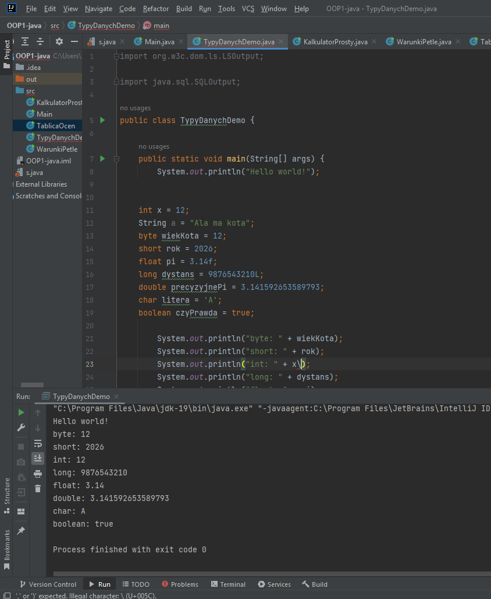
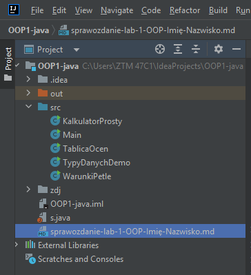
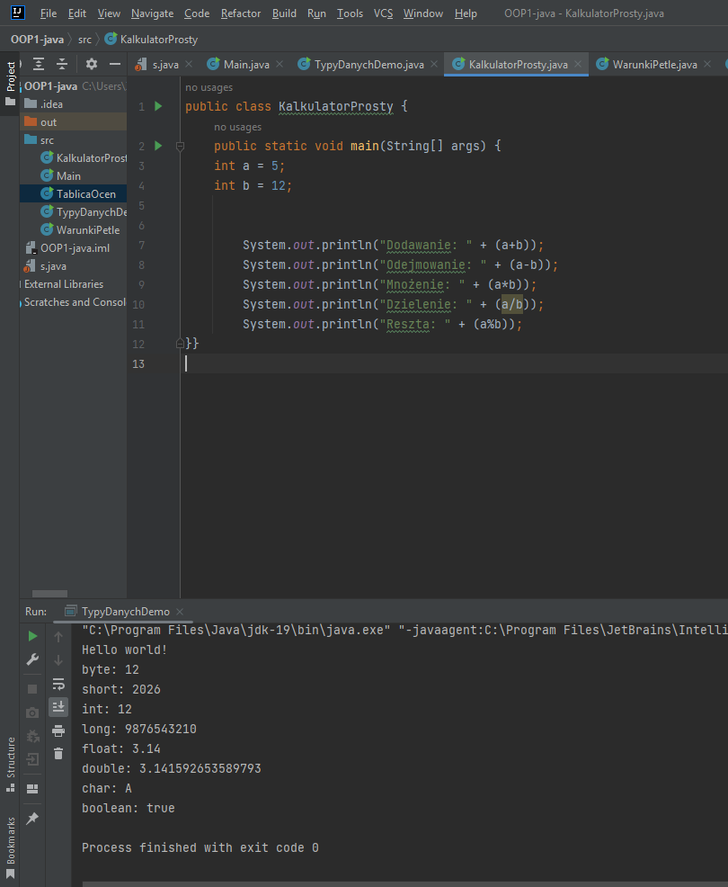
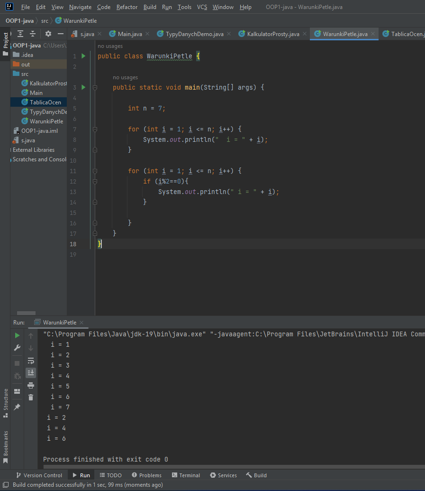
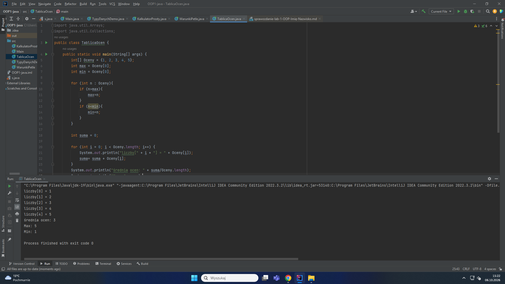

## I. Dokumentacja do lab. nr 1 - "Klasy oraz ich elementy składowe, metody klasy"
## II. Imię i nazwisko - grupa ABC, semestr III
## III. Przedmiot - "Programowanie obiektowe"

## IV. Opis zadania do realizacji
Do zrealizowania były następujące zadania:  
  - Program TypyDanychDemo, który deklaruje po jednej zmiennej każdego typu prymitywnego i wypisuje ich wartości wraz z opisem. 
  - Program KalkulatorProsty, który dla dwóch liczb całkowitych pokazuje: sumę, różnicę, iloczyn, iloraz całkowity i resztę z dzielenia. 
  - Program WarunkiIPetle, który dla liczby n wypisze liczby od 1 do n oraz osobno tylko liczby parzyste.  
  - Program TablicaOcen, który oblicza średnią z tablicy ocen i wypisuje ocenę najwyższą oraz najniższą.

## V. Technologie wykorzystane w zadaniu
  - Java,

## VI. Realizacja zadania
<br>

#### 1. Kod Javy (lub Pythona)
W zadaniu wykorzystano .... (krótko opisać, co zostało użyte).

Kod wykorzystany do rozwiązania zadania (zadań):  

```java
        public static void main(String[] args) {
        System.out.println("Hello world!");


        int x = 12;
        String a = "Ala ma kota";
        byte wiekKota = 12;
        short rok = 2026;
        float pi = 3.14f;
        long dystans = 9876543210L;
        double precyzyjnePi = 3.141592653589793;
        char litera = 'A';
        boolean czyPrawda = true;

        System.out.println("byte: " + wiekKota);
        System.out.println("short: " + rok);
        System.out.println("int: " + x);
        System.out.println("long: " + dystans);
        System.out.println("float: " + pi);
        System.out.println("double: " + precyzyjnePi);
        System.out.println("char: " + litera);
        System.out.println("boolean: " + czyPrawda);
      }
    }
```

#### 2. Zrzuty ekranu pokazujące wynik działania aplikacji/skryptu:  


#### 2a. Struktura projektu/programu:  


#### 1. Kod Javy (lub Pythona)
W zadaniu wykorzystano podstawowe funkcje matematyczne

Kod wykorzystany do rozwiązania zadania (zadań):

```java
         public static void main(String[] args) {
        int a = 5;
        int b = 12;


        System.out.println("Dodawanie: " + (a+b));
        System.out.println("Odejmowanie: " + (a-b));
        System.out.println("Mnożenie: " + (a*b));
        System.out.println("Dzielenie: " + (a/b));
        System.out.println("Reszta: " + (a%b));
        }
```


#### 2. Zrzuty ekranu pokazujące wynik działania aplikacji/skryptu:


#### 2a. Struktura projektu/programu:


#### 1. Kod Javy (lub Pythona)
W zadaniu wykorzystano pętle for.

Kod wykorzystany do rozwiązania zadania (zadań):

```java
        public static void main(String[] args) {

        int n = 7;

        for (int i = 1; i <= n; i++) {
        System.out.println("  i = " + i);
        }

        for (int i = 1; i <= n; i++) {
        if (i%2==0){
        System.out.println(" i = " + i);
        }

        }
```


#### 2. Zrzuty ekranu pokazujące wynik działania aplikacji/skryptu:


#### 2a. Struktura projektu/programu:


#### 1. Kod Javy (lub Pythona)
W zadaniu wykorzystano tablice oraz pętle for.

Kod wykorzystany do rozwiązania zadania (zadań):

```java
       public static void main(String[] args) {
        int[] Oceny = {1, 2, 3, 4, 5};
        int max = Oceny[0];
        int min = Oceny[0];

        for (int n : Oceny){
        if (n>max){
        max=n;
        }
        if (n<min){
        min=n;
        }
        }

        int suma = 0;

        for (int i = 0; i < Oceny.length; i++) {
        System.out.println("liczby[" + i + "] = " + Oceny[i]);
        suma= suma + Oceny[i];
        }
        System.out.println("średnia ocen: " + suma/Oceny.length);
        System.out.println("Max: " + max);
        System.out.println("Min: " + min);
        }
```

#### 2. Zrzuty ekranu pokazujące wynik działania aplikacji/skryptu:


#### 2a. Struktura projektu/programu:

